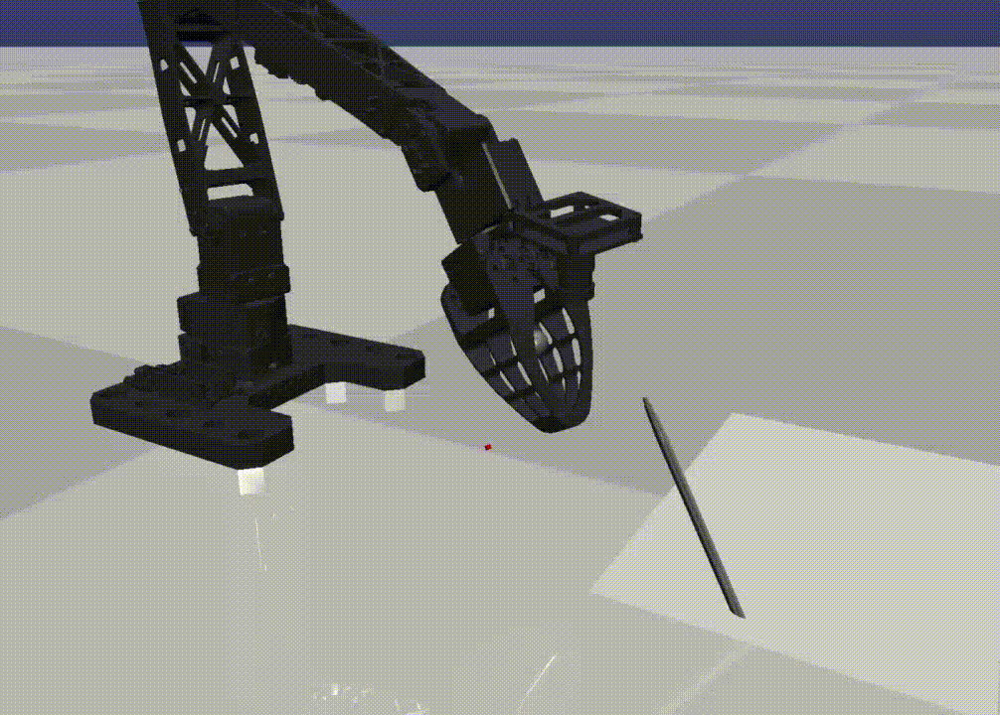
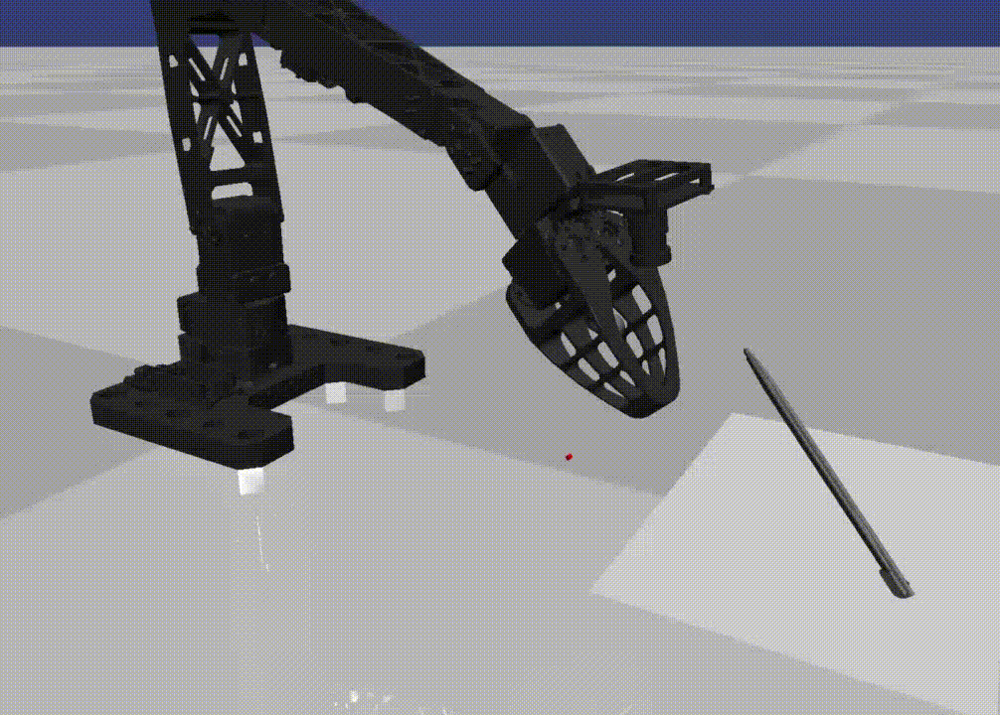
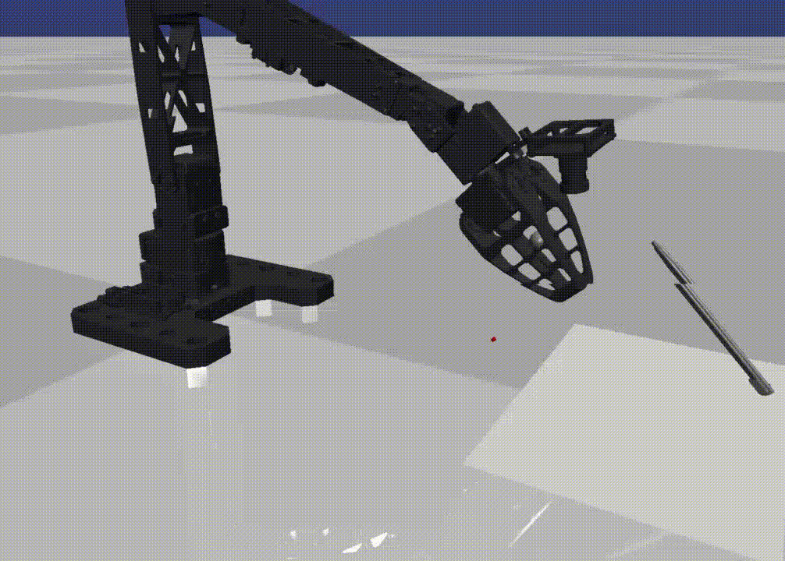
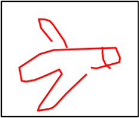
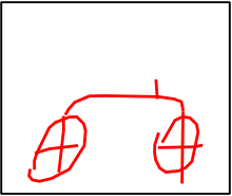
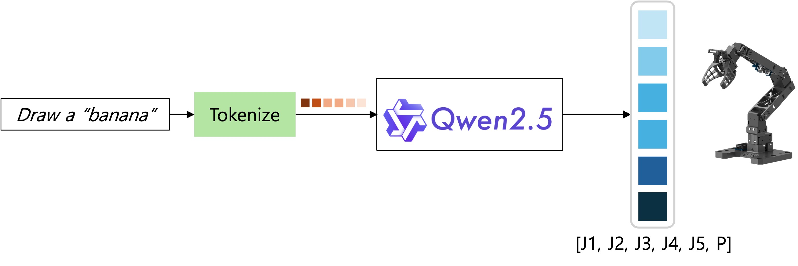
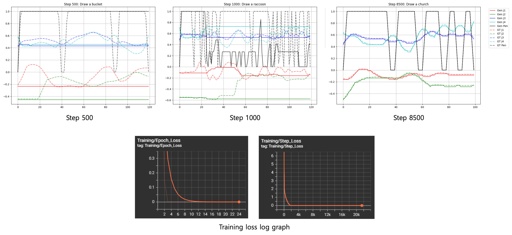

# Drawing Robot With Large Language Model

This repository is the implementation of the class: Robot learning 101 (JBNU 2025 fall, M.S course)
Used LLM: Qwen2.5-instruct-7B
Simulation tool: Mujoco
Robot platform: ROBOTIS OMX

## Setup

### Step1: Prepare dataset (I used QuickDraw dataset)

### Step2: Convert to jsonl
`python dataset_generate.py`

If you want to check the dataset, run `python check_dataset.py`

### Step3: Prepare your joint dataset: 
`python ./Drawing-with-OMX/notebook/drawing/gen_data.py`

If you want to show how the robot simulator generates the dataset, convert 'visualize' to True (in gen_data.py)

<table>
  <tr>
    <td width="25%"></td>
    <td width="25%"></td>
    <td width="25%"></td>
    <td width="25%"></td>
  </tr>
</table>
<table>
  <tr>
    <td width="25%"></td>
    <td width="25%"></td>
    <td width="25%"></td>
    <td width="25%"></td>
  </tr>
</table>

## Training
`python finetuning.py`

  
    
  

## inference
`python infer.py`

